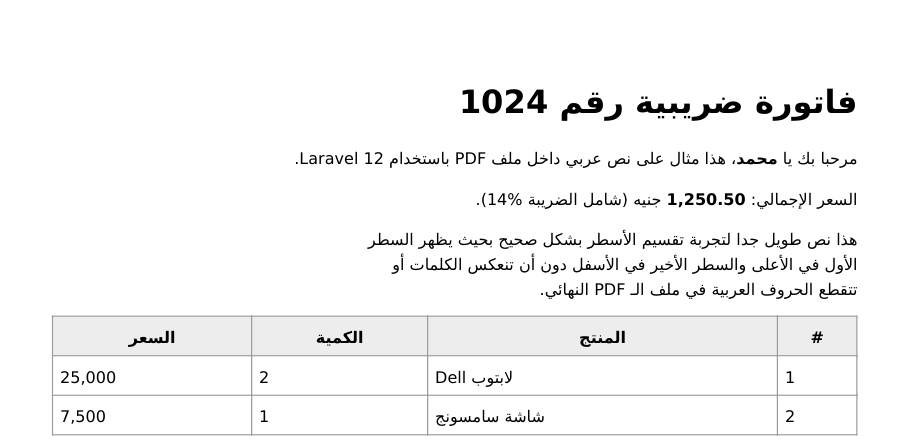

# Laravel Arabic PDF

[](https://github.com/mostafamoknaa/laravel-arabic-pdf/actions/workflows/tests.yml)
[](https://packagist.org/packages/mostafamoknaa/laravel-arabic-pdf)
[](https://packagist.org/packages/mostafamoknaa/laravel-arabic-pdf)
[](LICENSE.md)

Generate PDFs with **correct Arabic text** in Laravel.

dompdf, the most used PDF library in Laravel, has no Arabic support. The letters come out **disconnected** (م ح م د instead of محمد) and the words are **reversed**. This package fixes both, with no changes to your Blade views:

- **Connected letters**: every letter gets its correct initial / medial / final / isolated form, plus the lam-alef ligatures (لا، لأ، لإ، لآ).
- **Right-to-left order**: words are placed right to left using the Unicode Bidirectional Algorithm, while numbers, prices, percentages and English words stay left to right.
- **Mixed content**: `<b>`, `<span>`, `<a>`, … inside Arabic paragraphs are placed correctly.
- **RTL tables**: columns go from right to left inside `dir="rtl"`.
- **Multi-line paragraphs**: optional line wrapping so long paragraphs don't read bottom to top.
- Persian letters (پ چ ژ گ ک ی) are supported too.

> **بالعربي:** حزمة Laravel لإنشاء ملفات PDF باللغة العربية بشكل صحيح: الحروف متصلة، والكلمات بترتيبها الصحيح من اليمين لليسار، مع الحفاظ على الأرقام والكلمات الإنجليزية، ودعم الجداول والنصوص الطويلة.



## Requirements

- PHP 8.1+
- Laravel 10, 11, 12 or 13
- `ext-dom` and `ext-mbstring`

## Installation

```bash
composer require mostafamoknaa/laravel-arabic-pdf
```

The service provider and the `ArabicPdf` / `Arabic` facades are registered automatically.

To publish the config file (optional):

```bash
php artisan vendor:publish --tag=arabic-pdf-config
```

## Usage

### 1. Create a Blade view

Add `dir="rtl"` to `<html>` (or to any element) so text is right-aligned and tables go right to left.

```blade
{{-- resources/views/pdf/invoice.blade.php --}}
<!DOCTYPE html>
<html dir="rtl" lang="ar">
<head>
    <meta charset="utf-8">
    <style>
        body { font-family: 'DejaVu Sans', sans-serif; }
        table { width: 100%; border-collapse: collapse; }
        td, th { border: 1px solid #999; padding: 6px; }
    </style>
</head>
<body>
    <h1>فاتورة رقم {{ $invoice->number }}</h1>
    <p>العميل: <b>{{ $invoice->customer }}</b></p>

    <table>
        <tr><th>المنتج</th><th>الكمية</th><th>السعر</th></tr>
        @foreach ($invoice->items as $item)
            <tr><td>{{ $item->name }}</td><td>{{ $item->qty }}</td><td>{{ $item->price }}</td></tr>
        @endforeach
    </table>
</body>
</html>
```

### 2. Generate the PDF

```php
use MostafaMoknaa\ArabicPdf\Facades\ArabicPdf;

class InvoiceController
{
    public function show(Invoice $invoice)
    {
        return ArabicPdf::loadView('pdf.invoice', ['invoice' => $invoice])
            ->stream('invoice.pdf');      // show in the browser
    }

    public function download(Invoice $invoice)
    {
        return ArabicPdf::loadView('pdf.invoice', ['invoice' => $invoice])
            ->setPaper('a4', 'landscape')
            ->download('فاتورة.pdf');      // download (Arabic file names work)
    }
}
```

### All methods

```php
$pdf = ArabicPdf::loadView('view.name', $data);   // from a Blade view
$pdf = ArabicPdf::loadHTML('<p>مرحبا</p>');       // from an HTML string
$pdf = ArabicPdf::loadFile('/path/to/file.html'); // from an HTML file

$pdf->setPaper('a4', 'portrait');                 // paper size and orientation
$pdf->setOption('isRemoteEnabled', true);         // any dompdf option

$pdf->stream('file.pdf');                         // inline response
$pdf->download('file.pdf');                       // download response
$pdf->save(storage_path('app/file.pdf'));         // save to disk
$pdf->output();                                   // raw PDF string
$pdf->html();                                     // processed HTML (debugging)
$pdf->getDompdf();                                // the underlying Dompdf instance
```

## Long paragraphs

dompdf wraps lines itself, without knowing about Arabic. A long paragraph would therefore show its **last** words on the **first** line. To avoid this, wrap long paragraphs at a number of characters with the `data-arabic-wrap` attribute:

```html
<p data-arabic-wrap="80">نص طويل جدا ...</p>
```

Or set `max_chars_per_line` in `config/arabic-pdf.php` to apply it everywhere. Choose a value that fits the width of your column and font size. Short texts (titles, labels, table cells) don't need it.

## Using only the text helpers

Already using [barryvdh/laravel-dompdf](https://github.com/barryvdh/laravel-dompdf) or another library? Use the `Arabic` facade to fix the HTML or the text yourself:

```php
use Barryvdh\DomPDF\Facade\Pdf;
use MostafaMoknaa\ArabicPdf\Facades\Arabic;

$html = Arabic::html(view('pdf.invoice', $data)->render());

return Pdf::loadHTML($html)->download('invoice.pdf');
```

```php
Arabic::fix('مرحبا بكم');                 // shaped + visual order, lines separated by "\n"
Arabic::fix('نص طويل ...', 60);           // wrapped every 60 characters
Arabic::fixForHtml("سطر\nسطر آخر");       // escaped, lines joined with <br>
Arabic::shape('مرحبا');                   // connect the letters only
Arabic::containsArabic('Hello مرحبا');    // true
```

Or the `@arabic` Blade directive (escaped output):

```blade
<td>@arabic($product->name)</td>
<p>@arabic($product->description, 80)</p>
```

Don't use `@arabic` inside views that go through `ArabicPdf::loadView()`, since those are already fixed automatically. Fixing twice is safe but unnecessary.

## Skipping elements

Add `data-arabic-skip` to keep an element's text as it is:

```html
<div data-arabic-skip>...</div>
```

`<script>`, `<style>`, `<textarea>` and `<svg>` are always skipped.

## Fonts

The font must contain the Arabic Presentation Forms glyphs (U+FB50–U+FDFF and U+FE70–U+FEFF). **DejaVu Sans** ships with dompdf, has them, and is the default font. To use another font, register it with `@font-face` (a TTF file inside your project):

```html
<style>
    @font-face {
        font-family: 'Amiri';
        src: url('{{ resource_path('fonts/Amiri-Regular.ttf') }}') format('truetype');
        font-weight: normal;
    }
    @font-face {
        font-family: 'Amiri';
        src: url('{{ resource_path('fonts/Amiri-Bold.ttf') }}') format('truetype');
        font-weight: bold;
    }
    body { font-family: 'Amiri', 'DejaVu Sans', sans-serif; }
</style>
```

Many modern web fonts only support Arabic through OpenType features and don't include these glyphs. If you see empty boxes or "?", your font is missing them, so try another font.

## Configuration

```php
// config/arabic-pdf.php
return [
    'paper' => 'a4',
    'orientation' => 'portrait',
    'default_font' => 'DejaVu Sans',
    'strip_harakat' => false,          // remove diacritics (tashkeel)
    'max_chars_per_line' => null,      // wrap long Arabic paragraphs globally
    'rtl_css' => true,                 // right-align dir="rtl" elements
    'reverse_table_columns' => true,   // RTL tables inside dir="rtl"
    'dompdf' => [ /* any Dompdf\Options option */ ],
];
```

## How it works

1. Your view is rendered to HTML and parsed with PHP's DOM extension.
2. Each Arabic text node is **shaped**: letters are replaced by their contextual presentation forms (for example ب becomes ﺑ, ﺒ, ﺐ or ﺏ depending on its neighbours).
3. The text is **reordered** from logical to visual order with the Unicode Bidirectional Algorithm. Arabic runs are reversed, while numbers and Latin runs keep their direction, and brackets are mirrored.
4. Inline elements inside RTL paragraphs and table cells inside `dir="rtl"` are reordered too.
5. The result is passed to dompdf, which just draws it left to right.

## Testing

```bash
composer test
```

## Contributing

Pull requests are welcome. Please add a test for any bug fix or new feature.

## License

The MIT License (MIT). See [LICENSE.md](LICENSE.md).
